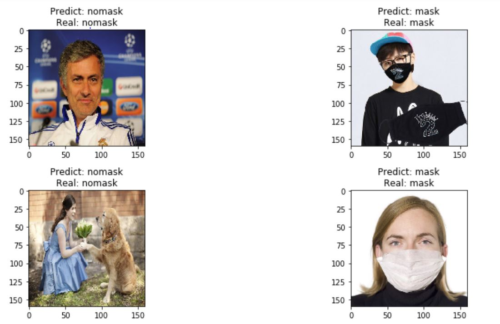
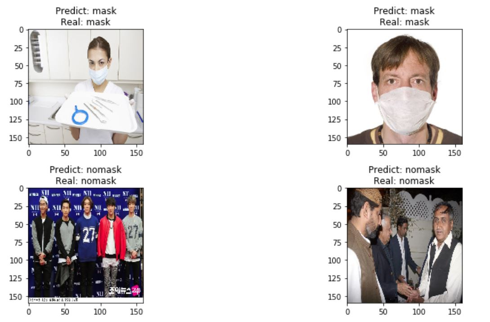
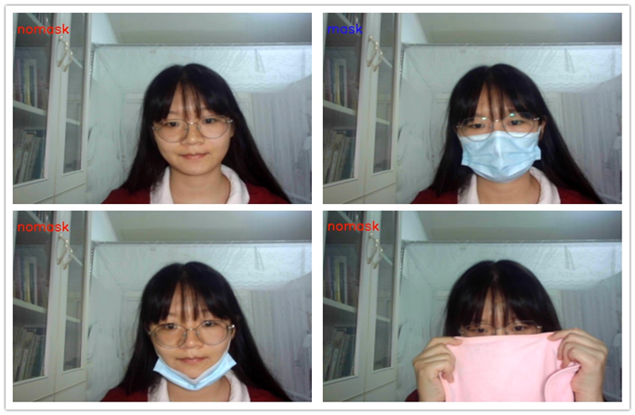

# AI口罩佩戴检测系统
此项目为2020年新工科联盟-Xilinx暑期学校（Summer School）项目

[English Version](README.md) | 中文版
## 简介
​		针对疫情防控（COVID-19）中的口罩佩戴识别的需求，基于Xilinx最新的Vitis-AI工具，结合自主设计的图像识别网络，快速开发出基于AI口罩佩戴识别系统。最终识别率可达88%以上，并可区分出正确佩戴口罩、不带口罩、错戴口罩、以及捂嘴、带围巾等遮挡的情况。
## 运行必须

1. Ultra96 V2开发板，SD卡
2. 网线、电源线、microUSB数据线
3. U96-pynq2.5镜像，升级支持DPU功能
4. 免驱动USB摄像头

## 运行步骤

1. 把仓库拷贝到Ultra96的jupyter_notebook目录下。
2. 在Ultra96的终端上，cd进入仓库文件夹后，进行初始化操作：
``` bash
sudo python3 ./setup.py
```
> 初始化时需要管理员权限改变文件属性
3. 连接上USB摄像头，打开浏览器，输入IP地址，可进入jupyter Notebook
4. 在用户PC上，按照jupyter Notebook的提示逐步地运行程序，即可看到效果

## 实验结果

#### 使用SD卡存储的验证数据进行测试：




#### 使用USB摄像头的实时识别口罩佩戴：


## 问题反馈与交流

欢迎各位爱好AI和FPGA设计的朋友们与我邮箱联系`我的邮箱：993987093@qq.com`

